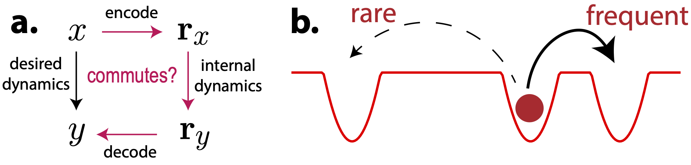
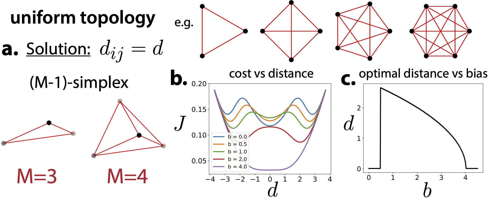
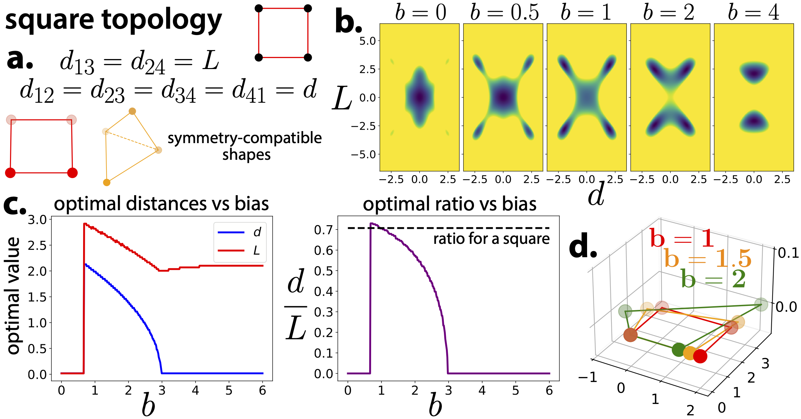

# Optimal packing of attractor states in neural representations (NeurReps 2023)

<div align="center">
<a href="https://proceedings.mlr.press/v228/vastola24a.html">Published version at PMLR</a> &nbsp;&nbsp;&nbsp; | &nbsp;&nbsp;&nbsp;
<a href="https://arxiv.org/abs/2504.12429">arXiv</a> &nbsp;&nbsp;&nbsp; | &nbsp;&nbsp;&nbsp;
<a href="https://openreview.net/forum?id=rmdSVvC1Qk">OpenReview</a> </div>
<br/>

This repo contains code that reproduces the figures from "**Optimal packing of attractor states in neural representations**", a paper accepted to [NeurReps](neurreps.org) 2023. 

**Abstract:**
> Animals' internal states reflect variables like their position in space, orientation, decisions, and motor actions -- but how should these internal states be arranged? Internal states which frequently transition between one another should be close enough that transitions can happen quickly, but not so close that neural noise significantly impacts the stability of those states, and how reliably they can be encoded and decoded. In this paper, we study the problem of striking a balance between these two concerns, which we call an `optimal packing' problem since it resembles mathematical problems like sphere packing. While this problem is generally extremely difficult, we show that symmetries in environmental transition statistics imply certain symmetries of the optimal neural representations, which allows us in some cases to exactly solve for the optimal state arrangement. We focus on two toy cases: uniform transition statistics, and cyclic transition statistics.

All code for reproducing the figures is in one self-contained Python notebook that uses only standard libraries (NumPy and Matplotlib).

The final figures, which are constructed from the components generated in this notebook, are as follows:

**Figure 1.** "Schematic of optimal packing problem"

<p align="center">
</p>

**Figure 2.** "Solution of packing problem for a Markov chain with a uniform topology"

<p align="center">
</p>

**Figure 3.** "Solution of packing problem for a Markov chain with a square topology"

<p align="center">
</p>

## Citation

```bibtex

@InProceedings{pmlr-v228-vastola24a,
      title = 	 {Optimal packing of attractor states in neural representations},
      author =       {Vastola, John},
      booktitle = 	 {Proceedings of the 2nd NeurIPS Workshop on Symmetry and Geometry in Neural Representations},
      pages = 	 {425--442},
      year = 	 {2024},
      editor = 	 {Sanborn, Sophia and Shewmake, Christian and Azeglio, Simone and Miolane, Nina},
      volume = 	 {228},
      series = 	 {Proceedings of Machine Learning Research},
      month = 	 {16 Dec},
      publisher =    {PMLR},
      pdf = 	 {https://raw.githubusercontent.com/mlresearch/v228/main/assets/vastola24a/vastola24a.pdf},
      url = 	 {https://proceedings.mlr.press/v228/vastola24a.html},
      abstract = 	 {Animals’ internal states reflect variables like their position in space, orientation, decisions, and motor actions—but how should these internal states be arranged? Internal states which frequently transition between one another should be close enough that transitions can happen quickly, but not so close that neural noise significantly impacts the stability of those states, and how reliably they can be encoded and decoded. In this paper, we study the problem of striking a balance between these two concerns, which we call an ‘optimal packing’ problem since it resembles mathematical problems like sphere packing. While this problem is generally extremely difficult, we show that symmetries in environmental transition statistics imply certain symmetries of the optimal neural representations, which allows us in some cases to exactly solve for the optimal state arrangement. We focus on two toy cases: uniform transition statistics, and cyclic transition statistics. Code is available at \url{https://github.com/john-vastola/optimal-packing-neurreps23}.}
}
```
